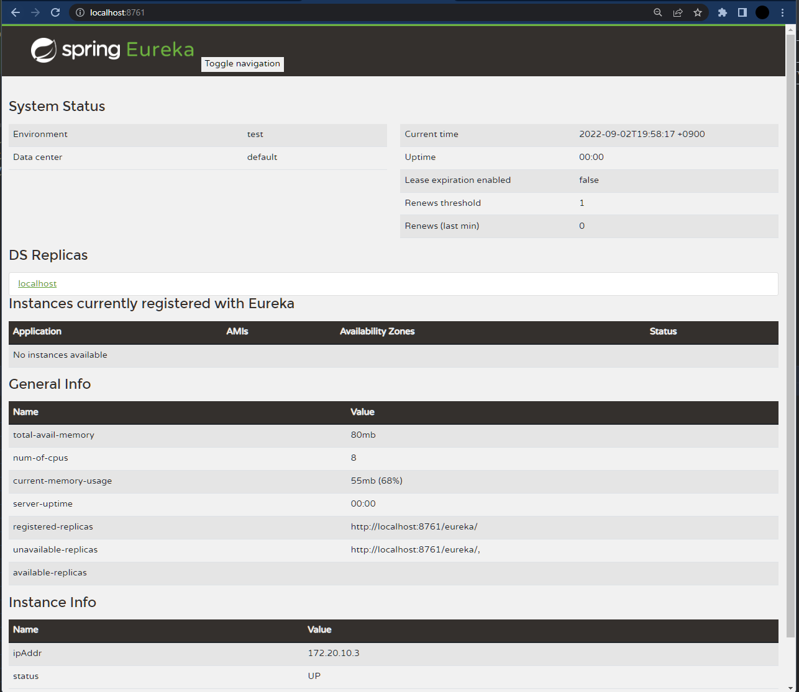

### Spring Cloud (Eureka)

```java
import org.springframework.boot.SpringApplication;
import org.springframework.boot.autoconfigure.SpringBootApplication;
import org.springframework.cloud.netflix.eureka.server.EnableEurekaServer;

@SpringBootApplication
@EnableEurekaServer
public class EcommerceApplication {

    public static void main(String[] args) {
        SpringApplication.run(EcommerceApplication.class, args);
    }

}
```

|키워드| 설명                                                          |
|:---|:------------------------------------------------------------|
|@EnableEurekaServer| Annotation to activate Eureka Server related configuration. |


